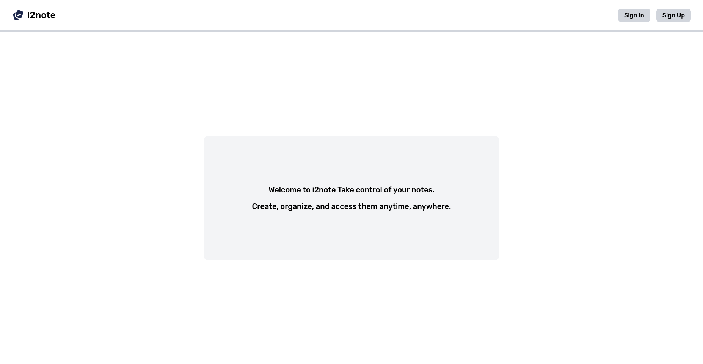
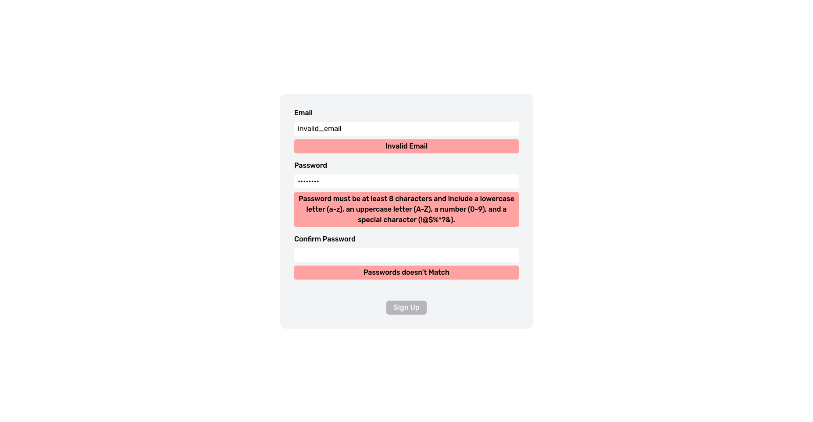
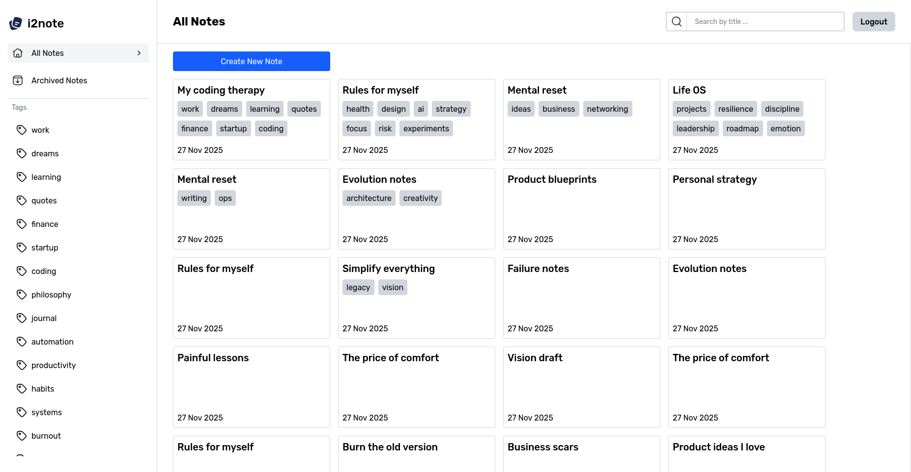
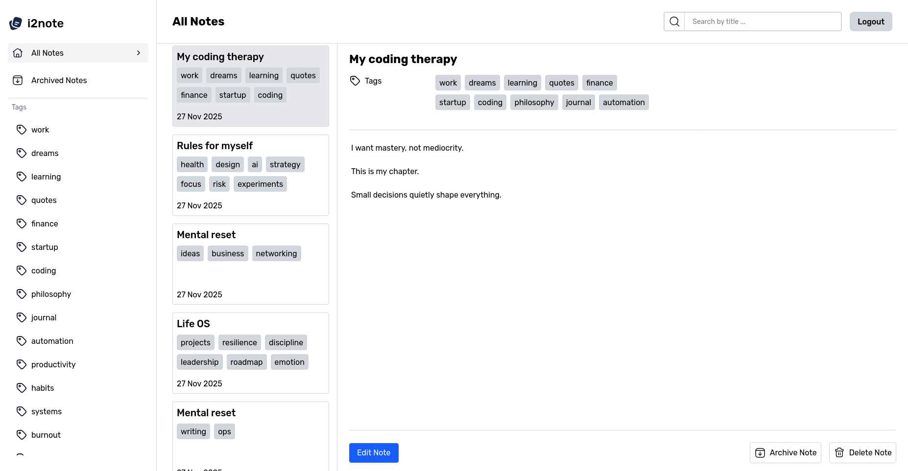
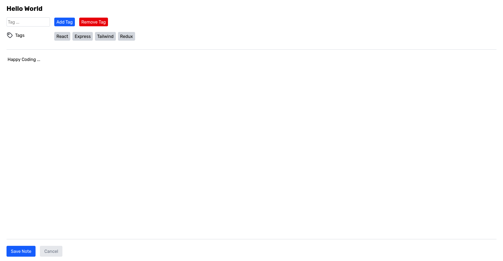

# Idea2Note (In Progress)

A simple full-stack web app for creating, organizing, and managing personal notes.

---

## Technical Stack

<div align="center">

| Icon                                                                                                          | Technology            | Purpose          |
| ------------------------------------------------------------------------------------------------------------- | --------------------- | ---------------- |
|  | **TypeScript**        | Type safety      |
|            | **React**             | User interface   |
|          | **Node.js (Express)** | Backend server   |
|            | **Redux**             | State management |
|                    | **Tailwind CSS**      | Styling          |

</div>

---

## Main Features

### Landing Page (Sign In / Sign Up)

<p align="center">
  
  
</p>

- User authentication (Sign In / Sign Up)
- Clean landing experience
- Secure access to personal notes

### Account Page (Notes & Tags)

<p align="center">
  
</p>

- View all notes
- View archived notes
- Filter by:
  - Tag
  - Title
- Tag system for organization

### View, Edit, and Manage Notes

<p align="center">
  
</p>

- Open note details
- Edit note content
- Delete notes
- Archive / Unarchive notes

### Create Notes

<p align="center">
  
</p>

- Create new notes
- Add tags
- Save and manage content easily

---

## How to Start the App

### 1. Clone repository

```bash
git clone <your-repo-url>
cd i2note
```

### 2. Install dependencies

Install packages for both backend and frontend:

```bash
cd backend
npm install

cd ../frontend
npm install
```

### 3. Create `.env` file

Inside the **backend** directory, create a file called `.env` and add:

```env
DATABASE_URL="file:./dev.db"
PORT="3000"
TRANSPORTER_EMAIL="your-email@gmail.com"
TRANSPORTER_PASSWORD="gmail-app-password"
SECRET="your-secret-key"

VITE_BACKEND_BASE_URI="http://localhost:3000"
VITE_FRONTEND_BASE_URI="http://localhost:5173"
```

### 4. Setup database

Inside **backend** folder:

```bash
npx prisma migrate dev
npx prisma generate
```

### 5. Run the project

Start backend:

```bash
cd backend
npm run dev
```

Start frontend:

```bash
cd frontend
npm run dev
```

---

The application should now be running locally.
